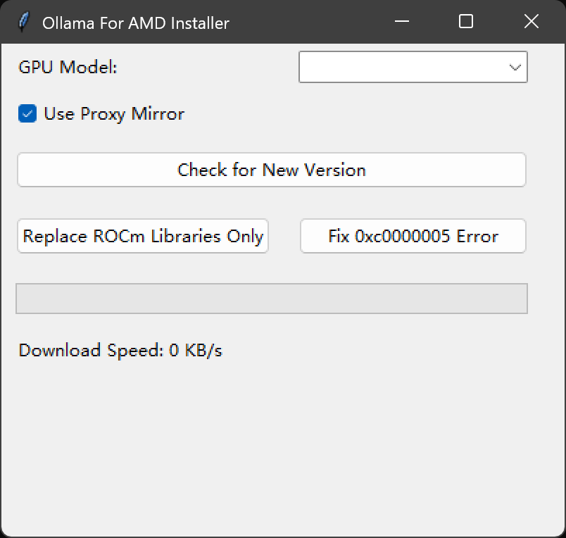

# Ollama-For-AMD-Installer

## Overview
I would like to extend my heartfelt thanks to [likelovewant](https://github.com/likelovewant/) for the [ollama-for-amd library](https://github.com/likelovewant/ollama-for-amd). 

This project was created to streamline the installation process of likelovewant's library, making it easier for users to manage and update their AMD GPU-compatible Ollama installations.

## Features

- **Check for New Versions**: Automatically checks and installs for the latest version of Ollama for AMD.
- **Replace ROCm Libraries**: Replaces the ROCm libraries ONLY.
- **Fix 0xc0000005 Error**: Provides a mechanism to fix the common `0xc0000005` error.
- **Proxy Support**: Option to use a proxy mirror for downloading files.

## Prerequisites

- Python 3.8 or higher
-  `py7zr`, `tqdm`

## Screenshot



## Installation
1. **Clone the Repository**:
   ```bash
   git clone https://github.com/ByronLeeeee/Ollama-For-AMD-Installer.git
   cd Ollama-For-AMD-Installer
   ```

2. **Install Dependencies**:
   ```bash
   pip install -r requirements.txt
   ```

OR 

Just download the latest release from the [releases page](https://github.com/ByronLeeeee/Ollama-For-AMD-Installer/releases).


## Usage

1. **Run the Application**:
   ```bash
   python ollama_installer.py
   ```

OR 

Just run the `Ollama-For-AMD-Installer.exe` as Administrator.

2. **GUI Interface**:
   - **GPU Model**: Select your AMD GPU model from the dropdown list.
   - **Use Proxy Mirror**: Check this box if you want to use a proxy mirror for downloading files.
   - **Check for New Version**: Click this button to check and install for the latest version of Ollama for AMD.
   - **Replace ROCm Libraries Only**: Click this button to replace the ROCm libraries. *This step is usually done automatically during the installation process.*
   - **Fix 0xc0000005 Error**: Click this button to attempt to fix the `0xc0000005` error.

## Contributing

Contributions are welcome!

Please feel free to submit a pull request or open an issue for any bugs or feature requests.

## License

This project is licensed under the MIT License. See the [LICENSE](LICENSE) file for details.

## Acknowledgments

- Thanks to the contributors and maintainers of the libraries and tools used in this project.

---

For any questions or support, please open an issue on GitHub.
