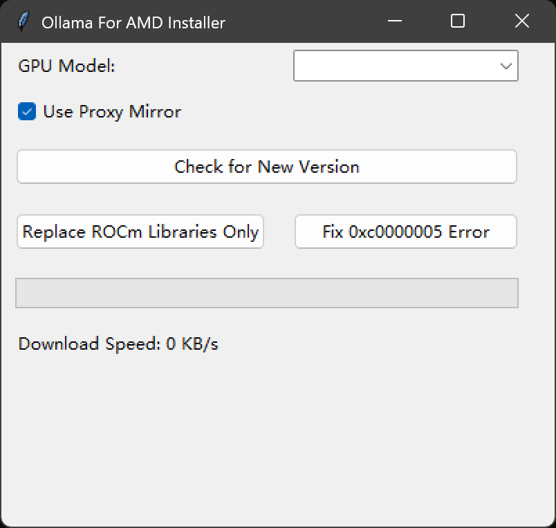

# Ollama-For-AMD-Installer

## A Note from the Author
Thank you all for your incredible support! I am committed to maintaining this project to the best of my ability.

However, I have recently upgraded my primary desktop PC to an **NVIDIA RTX 5070 Ti** (It's awesome :D). This means I can no longer personally test the installer on a dedicated AMD graphics card. My development and testing will now rely on the official documentation from the [ollama-for-amd](https://github.com/likelovewant/ollama-for-amd) repository and my laptop, which runs a **Ryzen 6800H APU with 680M graphics (gfx1036)**. While this allows me to validate functionality for many APU users, I appreciate your understanding and welcome community feedback, especially for dGPU-related issues.

## Overview
This tool simplifies the installation and management of the community-driven [ollama-for-amd library](https://github.com/likelovewant/ollama-for-amd). It provides a user-friendly graphical interface to automate the complex process of injecting ROCm libraries into the official Ollama application, ensuring your AMD hardware works seamlessly.



## Features

- **Automated Workflow**: Supports full installation of a matched Ollama app and AMD libraries, or library injection for existing setups.
- **Matched Releases**: Selects published Windows assets and pairs the Ollama backend with ROCm 7.1.1 or 6.4.2 libraries. Full installation uses an installer from the same Ollama version.
- **Local Packages**: Inject matching ZIP or 7z archives already downloaded on your computer.
- **Recovery**: Verifies download size and available SHA-256 digests, stages archives before deployment, and backs up affected files for rollback and restoration.
- **Auto-Detection**: Built-in hardware scanner to identify your AMD GPU and automatically select the correct ROCm architecture profile.
- **Smart Downloader**: Handles complex network conditions, including automatic bypass for official downloads and robust error handling for corrupted packages.
- **Troubleshooting Tools**: 
    - One-click fix for the common `0xc0000005` runtime error.
    - Vulkan mode configuration utility.
- **Network Optimization**: Built-in proxy tester to verify and select the fastest connection mirror for GitHub downloads.
- **Modern Interface**: Clean, native-style GUI with real-time console logging for better visibility during installation.

## Installation

### Option 1: Download the Executable
The easiest way to get started is to download the latest `Ollama-For-AMD-Installer.exe` from the [**Releases Page**](https://github.com/ByronLeeeee/Ollama-For-AMD-Installer/releases).

### Option 2: Build from Source
1.  **Clone the repository:**
    ```bash
    git clone https://github.com/ByronLeeeee/Ollama-For-AMD-Installer.git
    cd Ollama-For-AMD-Installer
    ```

2.  **Install dependencies:**
    ```bash
    pip install -r requirements.txt
    ```   
   *Prerequisites: Windows and Python 3.10+ with Tkinter. This installer does not support Linux or macOS.*

3. **Run the application:**
   ```bash
   python ollama_installer.py
   ```

## How to Use

1.  **Run as Administrator**: The application requires administrative privileges to replace system DLLs within the Ollama installation directory.
2.  **GPU Configuration**: 
    - Click **"Auto-Detect"** to have the app identify your AMD hardware, or choose manually from the dropdown list.
3.  **Choose an Action**:
    - **1. Install Matched App + AMD Libs**: Installs an Ollama version with a compatible community backend and matching ROCm libraries. This can install an older Ollama version than the latest official release.
    - **2. Inject AMD Libs Only**: Select the existing folder containing `ollama.exe`. Online injection checks the installed client version and requires a community backend for that exact version.
    - **3. Enable Vulkan**: Sets `OLLAMA_VULKAN=1`. Current official Ollama enables Vulkan by default when the backend is installed.
4.  **Network Setup**: If the download fails, use the "Proxy & Network Settings" section to test available mirrors and select a faster, more stable endpoint.

## Compatibility and recovery

Verified upstream combinations as of **2026-10-01**:

| ROCm SDK | Downloadable community Ollama | Backend directory |
| --- | --- | --- |
| 7.1.1 | v0.30.8 | `lib/ollama/rocm_v7_1` |
| 6.4.2 | v0.20.8 | `lib/ollama/rocm` |

The installer examines actual release assets and skips empty or prerelease entries. Unknown ROCm metadata is rejected. It obtains GPU package filenames from the matching library release API. Older ROCm 5.7 packages are not offered because recent upstream builds no longer support that runtime.

For offline injection, install Ollama first, select both the **Framework** and **GPU libs** archives, choose their ROCm SDK and GPU profile, then click **Inject AMD Libs Only**. Local packages must come from the same Ollama release and ROCm SDK as the installed application; local archives do not always contain version metadata, so the installer cannot verify their complete ABI pairing. The archive layout and required DLL/kernel files are checked before deployment.

The **Enable integrated GPU** checkbox sets `OLLAMA_IGPU_ENABLE=1` after successful injection. Sign out and back in to refresh the environment before launching Ollama. The checkbox being unchecked leaves the existing environment setting as it is.

**Restore Last Injection Backup** restores files saved before the latest injection. Backups are stored under `.amd-installer-backups` in the selected Ollama installation. Each successful injection creates a backup; repeated restores undo them in reverse order. Restoration covers injected files, while full app installation and the integrated GPU environment setting are outside the file backup.

The [upstream RX 6700 XT report](https://github.com/likelovewant/ollama-for-amd/issues/134) describes a ROCm 7.1.1 regression. For affected gfx1031 users, select 6.4.2 and use the matched full installation, or restore a previous working backup. Hardware inference still requires validation on the target GPU. For RX 550X/gfx803 and other unsupported older GPUs, use official Vulkan if supported by the driver; these GPUs do not have a current supported ROCm package in this installer.

## Build an executable

```bash
python -m pip check
python -m pip install pyinstaller==6.10.0
python -m PyInstaller --noconfirm --onefile --windowed --uac-admin --name Ollama-For-AMD-Installer ollama_installer.py
```

## Contributing
Contributions are always welcome! Please feel free to open an issue or submit a pull request to:
- Report bugs or suggest improvements.
- Request new features or library support.
- Enhance the documentation.

## License
This project is licensed under the MIT License. See the [LICENSE](LICENSE) file for details.
